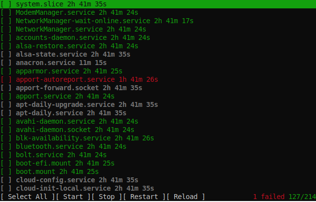

# targetctl
A tuilight systemctl status and journal viewer



## What works
- Query services based on a number of dependency criteria
- Show status and uptime
- Select/deselect services
- Start/Stop/Restart/Reload services

## Todo/Issues
- Add a journal viewer

## Build
```bash
mkdir build
cd build
cmake -DCMAKE_RELEASE_TYPE=Release ..
make -j
sudo make install #Optional, to install
```

## Run
```
Usage: targetctl [--help] [--version] [--tree] [--required-by] [--requires] [--wanted-by] [--wants] [--consists-of] [--part-of] target

And interactive systemd controller.
https://github.com/ibensw/targetctl

Positional arguments:
  target             The systemd target to observe [nargs=0..1] [default: "-.slice"]

Optional arguments:
  -h, --help         shows help message and exits
  -v, --version      prints version information and exits
  -t, --tree         Enable recursive scanning
  -r, --required-by
  -R, --requires
  -w, --wanted-by
  -W, --wants
  -c, --consists-of
  -C, --part-of
```

## Dependencies
- [tuilight](https://github.com/ibensw/tuilight) (staticly linked)
- [argparse](https://github.com/p-ranav/argparse) (staticly linked)
